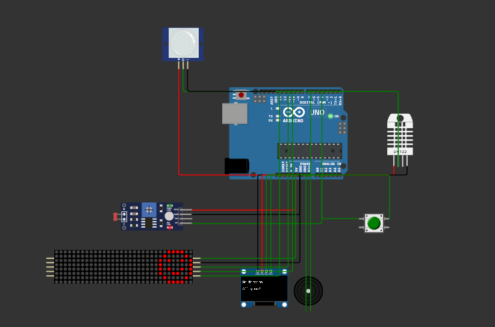

# Mission Wristband

## Overview
The **Mission Wristband** is a wearable, Arduino-based system designed to promote environmentally responsible behavior through interactive, real-time missions.  
By monitoring environmental conditions such as light levels, motion, and soil moisture, the device determines whether specific sustainable actions are required and presents them to the user in an engaging format.  

This project aligns with principles of the United Nations Sustainable Development Goals (SDGs), encouraging users to take small, actionable steps toward sustainability in their daily lives.

---

## System Components
- **Arduino Uno** – Central microcontroller for processing sensor data and controlling outputs.
- **PIR Motion Sensor** – Detects human presence to determine room occupancy.
- **LDR (Photoresistor)** – Monitors ambient light levels to detect unnecessary energy usage.
- **Soil Moisture Sensor** – Measures soil humidity to identify when plants require watering.
- **DHT11/DHT22 Sensor** – Captures temperature and humidity data for environmental awareness.
- **OLED Display (SSD1306)** – Presents mission text and system messages.
- **MAX7219 LED Matrix** – Displays relevant mission icons for visual reinforcement.
- **Push Button** – Allows the user to confirm mission completion.
- **Buzzer** – Provides audio feedback for completed tasks.
- **EEPROM** – Stores mission completion score for persistence after power cycles.

---

## Functional Description
1. **Initialization**
   - The OLED display presents a welcome message.
   - The LED matrix displays a heart icon, indicating readiness.

2. **Mission Generation**
   - **Low Soil Moisture** → Assigns *“Water Plant”* mission (leaf icon).
   - **No Motion Detected & High Light Level** → Assigns *“Turn Off Light”* mission (bulb icon).
   - **No Mission Conditions Met** → Displays *“All Good”* message with smiley icon.

3. **User Interaction**
   - The user presses the push button after completing a mission.
   - The device increments the stored score by 10 points in EEPROM.
   - OLED and LED matrix provide positive visual feedback.
   - The buzzer emits a brief success tone.

4. **Continuous Monitoring**
   - The system re-evaluates environmental conditions at regular intervals.

---

## Setup and Operation

### Hardware Setup
Refer to **`prototype.png`** for wiring details.  
Ensure each sensor and module is correctly connected to the Arduino Uno as per the schematic.

### Software Setup
1. Install the following Arduino libraries:
   - `Adafruit_SSD1306`
   - `Adafruit_GFX`
   - `DHT`
   - `EEPROM`
   - `LedControl`
2. Open the `.ino` source file in the Arduino IDE.
3. Select **Arduino Uno** as the target board.
4. Compile and upload the program.

---

## Example Missions
- **Water Plant** – Triggered when soil moisture is below a defined threshold.
- **Turn Off Light** – Triggered when no occupancy is detected and light levels remain high.

---

## Future Enhancements
- Integration of Bluetooth or Wi-Fi for mobile application connectivity.
- Expansion of mission types with additional sensors.
- Implementation of a rechargeable battery system for enhanced portability.
- Data logging for long-term behavioral tracking and analysis.

---

**Author:** Soban Mujtaba  
**Simulation Environment:** Wokwi  
**Project Type:** Embedded Systems / IoT Prototype
